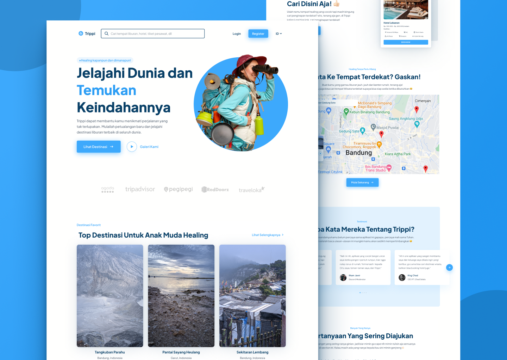

<h1 align="center">Trippi Landing page</h1>



<p align="center">Trippi is a free Travel Landing Page Template</p>
<div align="center">

[](https://github.com/rsurya99/trippi/graphs/contributors)


[](LICENSE)
[](https://GitHub.com/Naereen/StrapDown.js/graphs/commit-activity)

</div>

<p align="center">
	<a href="https://github.com/RSurya99/trippi" _blank="true">Demo Page</a>&nbsp;&nbsp;&nbsp;
	<a href="https://github.com/RSurya99/trippi">Documentation Page</a>&nbsp;&nbsp;&nbsp;
</p>

## Usage

```bash
# clone this repository or click 'use this template' button
$ git clone https://github.com/RSurya99/trippi.git
```

## Other version of trippi
- [Vue Trippi](https://github.com/rsurya99/vue-trippi)
- [React Trippi](https://github.com/rsurya99/react-trippi)
- [Svelte Trippi](https://github.com/rsurya99/svelte-trippi)


## Contributing

Please follow [Contributing Guide](./CONTRIBUTING.md) before contributing.

## License

Trippi is under [MIT License](./LICENSE).

## Author

Trippi is created & designed by <a href="https://rsurya.me">RSurya99</a>.